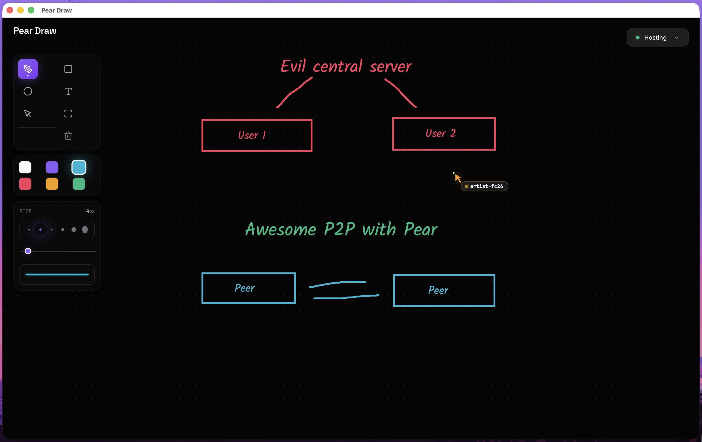
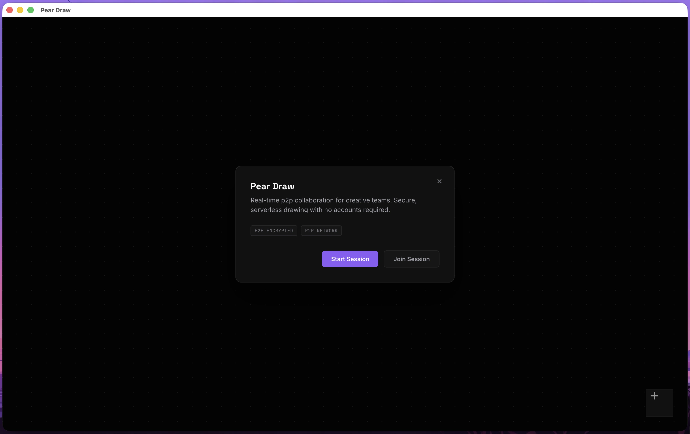
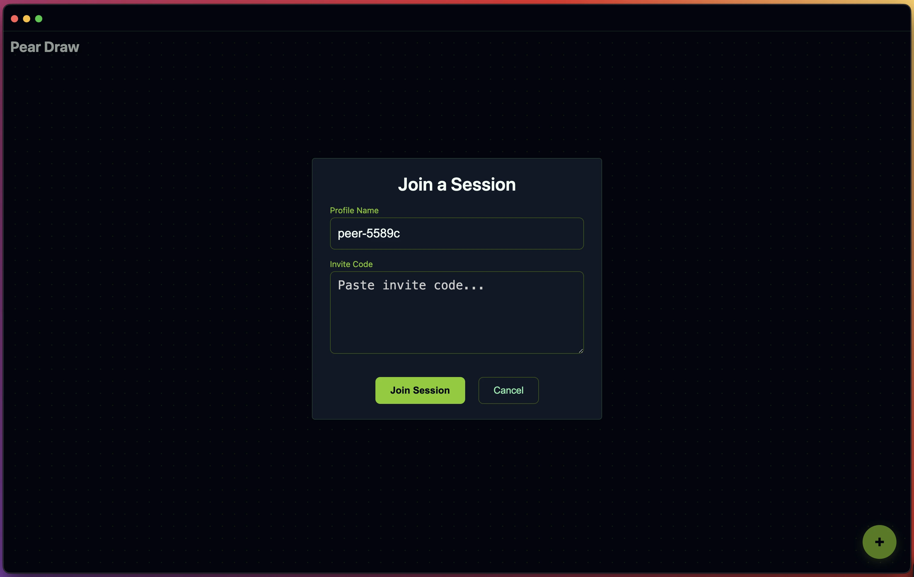

# 🍐 Pear Draw ✍️

**Infinite canvas - Private and Peer-to-Peer**

  

## Why

- No registeration. Add username and share boards.
- Data shared directly among users
- Local first, magically sync'd when online
- Carefully designed for better UX

## Usage

  
  

